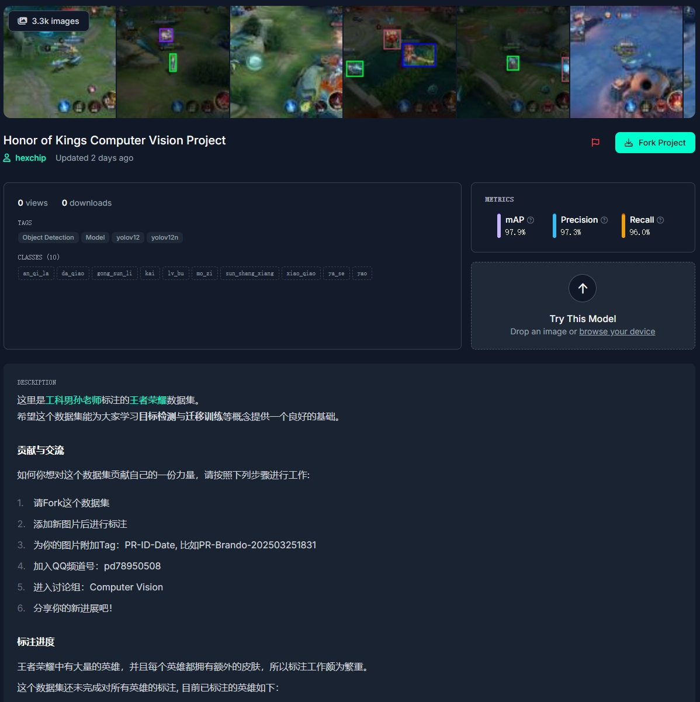
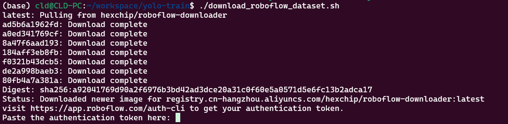
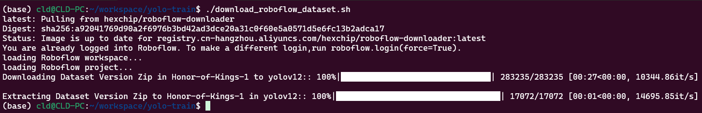
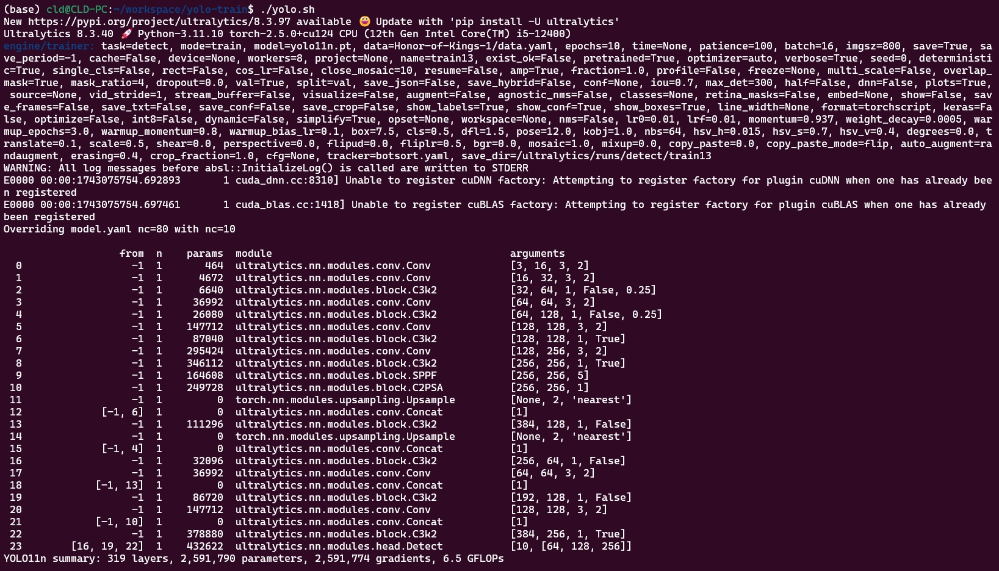
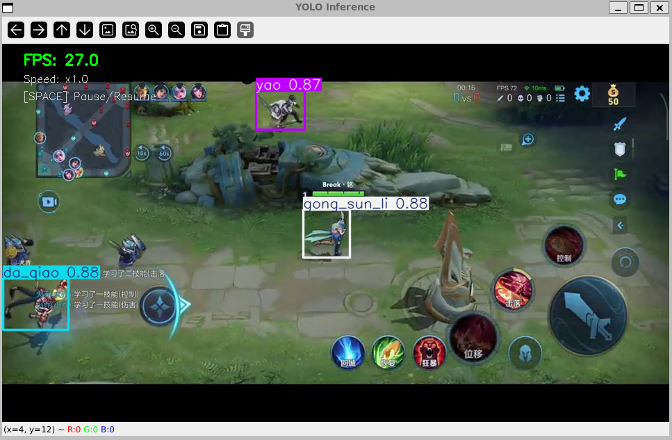
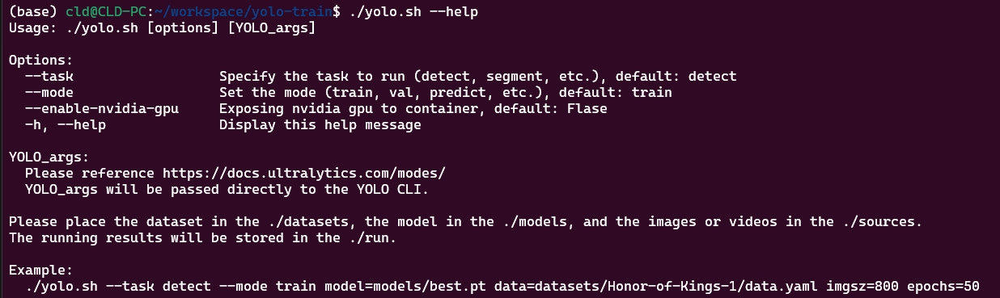

# Yolo-Train

这里只有一些简单的Shell Script。  
目的是让同学们可以简单的体验 Ultralytics YOLO 的训练过程。

准备好[WSL](https://learn.microsoft.com/zh-cn/windows/wsl/)和[Docker](https://www.docker.com/)，让我们开始吧！

**注：没有安装WSL和Docker的同学请[点击这里](https://mp.weixin.qq.com/s/0yHkGW7kIq4c8CHwrQrKFA)查看如何安装的图文教程**

## 快速开始

**注：确保本仓库位于WSL中**

先下载数据集，然后训练，最后使用训练好的模型进行推理。

### 获取数据集

共有三种方式获取示例数据集。

#### 浏览器

这是一份托管在[Roboflow](https://roboflow.com)平台上的[王者荣耀数据集](https://universe.roboflow.com/hexchip/honor-of-kings-u8coa)：


#### 百度网盘

对于不精通**科学上网**的同学，可以通过百度网盘下载：

链接: https://pan.baidu.com/s/1_czPYo_l2Mi9nlgK0r5Htw?pwd=jg5c  
提取码: jg5c

**下载完成后请解压到./datasets**

**注：百度网盘中只提供了yolo11格式的数据集**

#### Shell Script

**注：你需要先拥有Roboflow平台的账号，并且你的Terminal需要能科学上网**

执行下列命令，将自动下载数据集到./datasets目录。

```bash
./download_roboflow_dataset.sh
```

**首次执行**会要求你进行身份验证：


后续执行就不需要了：


#### 扩展知识

**想要学习如何创建目标检测数据集的同学，请[点击这里](https://mp.weixin.qq.com/s/CLOn9CTi9q84d_09_fBUBA)查看图文指南**

### 训练

执行下列命令：

```bash
./yolo.sh 
```


**然后你会发现训练速度奇慢无比。。。**

这是为了照顾没有Nvidia GPU的同学，默认是使用cpu进行训练。

执行下列命令启用Nvidia GPU：

```bash
./yolo.sh --enable-nvidia-gpu
```

**没有Nvidia GPU的话，会报错。**

如果你问AMD的GPU行不行，那当然行。  
**可是我手头上没有**。。。  
欢迎使用AMD GPU的同学参与改善代码！

最后，你会在`./run/detect/train*/weights`目录下中找到训练好的模型权重。

### 推理

自己训练太漫长了，先取消(Ctrl+C)吧！

在这里下载已经训练好的权重：
https://pan.baidu.com/s/1NS2GwtJTLXewkhhSOzMkdQ?pwd=29rs  
提取码: 29rs 

**将`best.pt`放到`./models`目录下。**

在这里下载测试视频：
链接: https://pan.baidu.com/s/1kZkq9SkCgAhPSLHThBwe_Q?pwd=cnds  
提取码: cnds 

**将`test.mp4`放到`./sources/videos`目录下。**

执行下列命令：

```bash
./yolo-infer_video.sh 
```



执行下列命令启用Nvidia GPU：

```bash
./yolo-infer_video.sh --enable-nvidia-gpu
```

## 更进一步

在前面我们围绕着一个特定的例子完成了**快速开始**，现在是时候扩展开来了！

### 了解 Shell Script

之前我们用到了一些`Shell Script`, 比如`yolo.sh`。  
当直接执行它时，它会使用默认参数运行。

这等价于：

```bash
./yolo.sh --task detect --mode train data=Honor-of-Kings-1/data.yaml imgsz=800
```

那么这些参数哪里有说明呢？  
答案是使用：

```bash
./yolo.sh --help
```



每个正经的`Shell Script`都会有这个功能的，快去试试吧！

### 使用任意数据集训练任意参数量的Yolo模型

你可以在 https://universe.roboflow.com/ 里挑选自己心仪的数据集，然后将他下载到本地。  
比如使用`download_roboflow_dataset.sh`:

```bash
download_roboflow_dataset.sh ./--datasetUrl myproject/mydataset/1 --datasetFormat yolov11
```

完成后，`mydataset-1`会出现在`./datasets`目录下

然后使用`yolo.sh`进行训练：

```bash
./yolo.sh model=yolo11m.pt data=mydataset-1/data.yaml imgsz=320 epochs=200
```

这时我们得到了一个经过200轮`mydataset-1`数据集训练的`yolo11m.pt`模型，它期望处理的图片大小是320x320。  
值得一提的是，它也能处理矩形图片，比如大小是320x288的图片。这是因为它的下采样最大步长为32。  
总之，**宽和高都得是32的倍数**。

最后使用`yolo.sh`来进行推理吧！  
等等。。。好像哪里有问题？  
没错，`yolo.sh` 能满足你的一切需要，如果只能训练的话，干嘛不叫`yolo_train.sh` :)

先搞一张图片放到`./sources/images`目录下，比如这张图片叫`test.png`。  
然后执行：

```bash
./yolo.sh --mode predict source=sources/images/test.png imgsz=320 conf=0.5
```

你就可以在`./run/detect/predict/test.png`这张图片上看到推理结果了。

你可能懒得手动打开它，想直接显示。可以！  
执行下列命令:

```bash
./yolo.sh --mode predict source=sources/images/test.png imgsz=320 conf=0.5 show=True
```

然后你会看到图片确实自动显示了，但是在你眼前一闪而过，只存在了0.5s！  
官方说，`show=True`参数是用来推理视频的！我觉得他们可以再努力努力。。。

试试推理视频吧，先搞个视频放到`./sources/videos`目录下，比如这个视频叫`test2.mp4`。  
然后执行：

```bash
./yolo.sh --mode predict source=sources/videos/test2.mp4 imgsz=320 conf=0.5 stream=True show=True
```

你看到了和之前使用`./yolo-infer_video.sh`推理视频时一样的窗口。  
`./yolo-infer_video.sh`：那我走？

如果你想暂停或快进，你会发现`./yolo.sh`满足不了你的需求。

而`./yolo-infer_video.sh`支持按空格暂停，按加号和减号调整倍速(加速的前提是你的推理速度够快)。

如果你问为什么没有慢放，我的回答是没时间做了!  
而且也不支持设置`imgsz=320`和`conf=0.5`这类重要的参数。。。  
**imgsz被固定设置为384, 800！imgsz=高,宽，别搞错了~**

最后，**欢迎同学们一起参与进来贡献自己的力量！**

也可以来[腾讯频道](https://pd.qq.com/g/pd78950508)来学习、讨论。

### 更多细节

- [download_roboflow_dataset](https://github.com/hexchip/download-roboflow-dataset)
- [yolo.sh 介绍](docs/yolo.md)
- [ultralytics-yolo-infer-video](https://github.com/hexchip/ultralytics-yolo-infer-video)